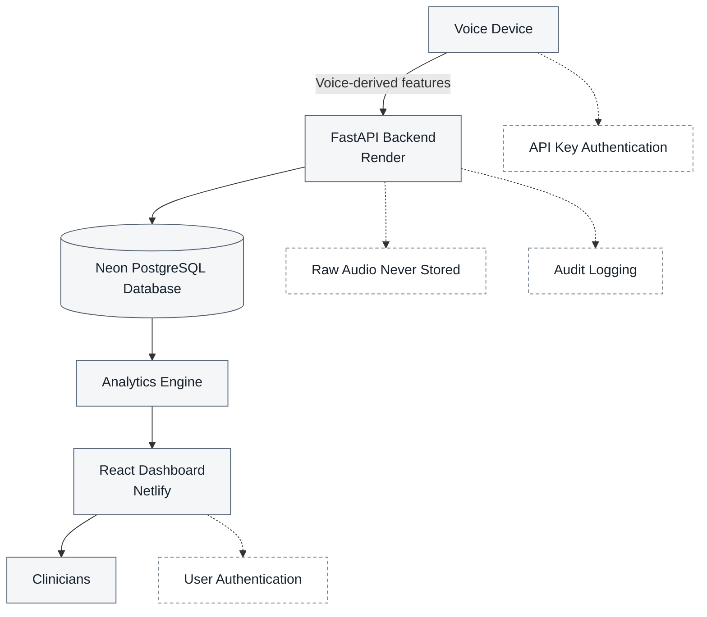

# Figure 1: EchoWell System Architecture

*Figure 1. EchoWell system architecture showing secure ingestion of voice-derived features, longitudinal analytics, and clinician-facing visualization.*

```mermaid
flowchart TB
    DEVICE[Voice Device] -->|Voice-derived features| API[FastAPI Backend<br/>Render]
    API --> DB[(Neon PostgreSQL Database)]
    DB --> ENGINE[Analytics Engine]
    ENGINE --> DASH[React Dashboard<br/>Netlify]
    DASH --> CLINICIANS[Clinicians]

    DEVICE -.-> APIKEY[API Key Authentication]
    API -.-> AUDIO[Raw Audio Never Stored]
    API -.-> AUDIT[Audit Logging]
    DASH -.-> USERAUTH[User Authentication]

    classDef system fill:#f4f6f8,stroke:#526273,color:#17212b
    classDef control fill:#ffffff,stroke:#7b8794,color:#17212b,stroke-dasharray:4 3
    class DEVICE,API,DB,ENGINE,DASH,CLINICIANS system
    class APIKEY,AUDIO,AUDIT,USERAUTH control
```
