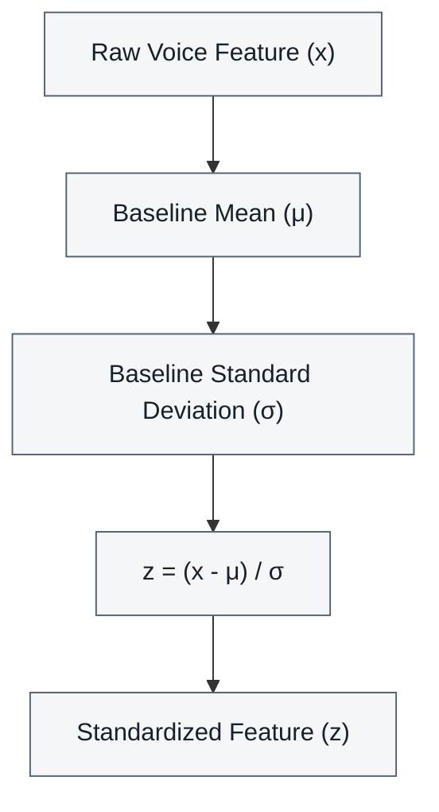

# Figure 3: z-Score Standardization Process

*Figure 3. Standardization process used to normalize measurements relative to an individual's baseline distribution.*

```mermaid
flowchart TB

    RAW["Raw Voice Feature (x)"]
    MEAN["Baseline Mean (μ)"]
    STD["Baseline Standard Deviation (σ)"]
    EQUATION["z = (x - μ) / σ"]
    RESULT["Standardized Feature (z)"]

    RAW --> MEAN
    MEAN --> STD
    STD --> EQUATION
    EQUATION --> RESULT

    classDef process fill:#f4f6f8,stroke:#526273,color:#17212b

    class RAW,MEAN,STD,EQUATION,RESULT process
```