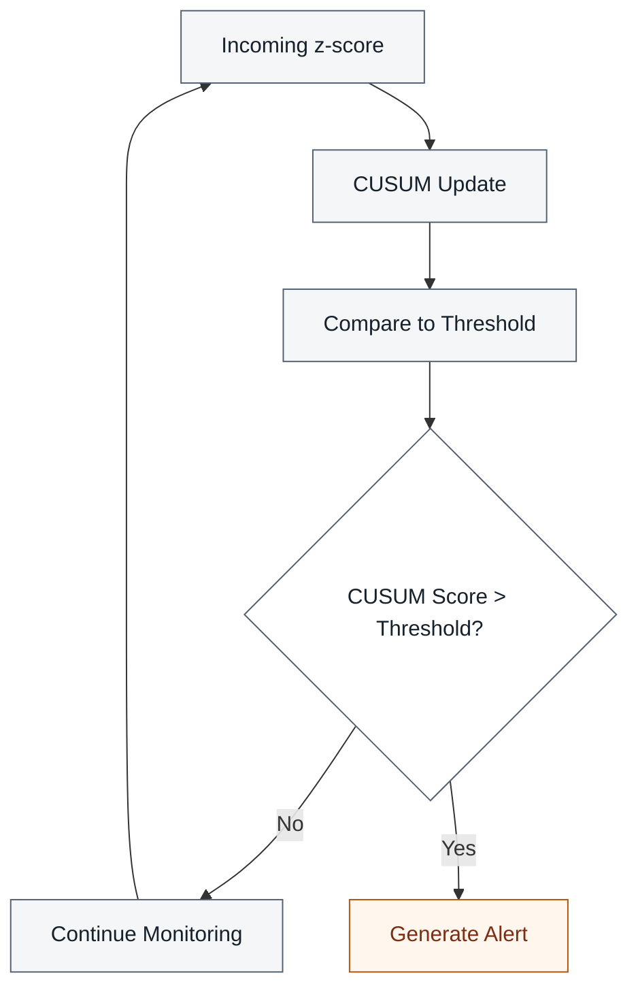

# Figure 4: CUSUM Monitoring Model

*Figure 4. CUSUM-based monitoring algorithm used to detect sustained deviations from baseline.*

```mermaid
flowchart TB

    INPUT["Incoming z-score"]
    UPDATE["CUSUM Update"]
    COMPARE["Compare to Threshold"]
    DECISION{"CUSUM Score > Threshold?"}
    CONTINUE["Continue Monitoring"]
    ALERT["Generate Alert"]

    INPUT --> UPDATE
    UPDATE --> COMPARE
    COMPARE --> DECISION

    DECISION -->|No| CONTINUE
    CONTINUE --> INPUT

    DECISION -->|Yes| ALERT

    classDef process fill:#f4f6f8,stroke:#526273,color:#17212b
    classDef decision fill:#ffffff,stroke:#526273,color:#17212b
    classDef alert fill:#fff7ed,stroke:#b45309,color:#7c2d12

    class INPUT,UPDATE,COMPARE,CONTINUE process
    class DECISION decision
    class ALERT alert
```