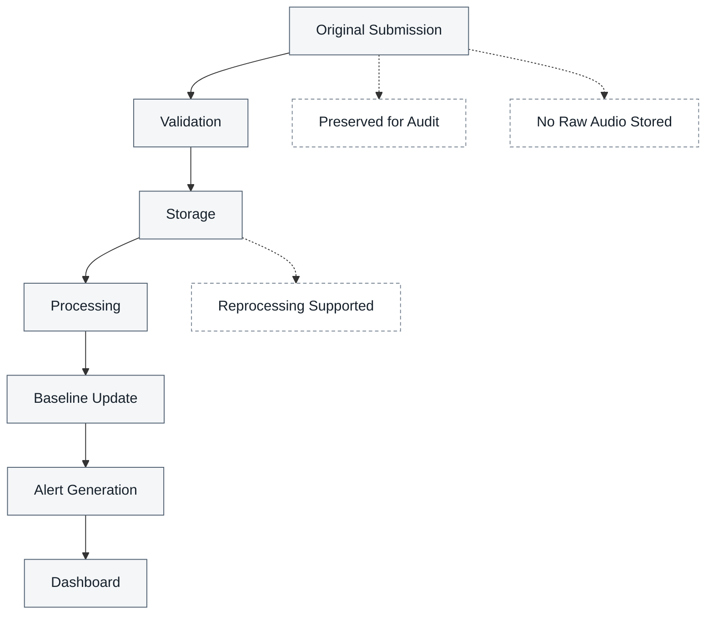

# Figure 6: Data Flow and Traceability Model

*Figure 6. Data traceability workflow showing how measurements are preserved, processed, and reused for future analysis.*

```mermaid
flowchart TB
    SUBMISSION[Original Submission] --> VALIDATION[Validation]
    VALIDATION --> STORAGE[Storage]
    STORAGE --> PROCESSING[Processing]
    PROCESSING --> BASELINE[Baseline Update]
    BASELINE --> ALERT[Alert Generation]
    ALERT --> DASHBOARD[Dashboard]

    SUBMISSION -.-> AUDIT[Preserved for Audit]
    STORAGE -.-> REPROCESS[Reprocessing Supported]
    SUBMISSION -.-> AUDIO[No Raw Audio Stored]

    classDef process fill:#f4f6f8,stroke:#526273,color:#17212b
    classDef note fill:#ffffff,stroke:#7b8794,color:#17212b,stroke-dasharray:4 3
    class SUBMISSION,VALIDATION,STORAGE,PROCESSING,BASELINE,ALERT,DASHBOARD process
    class AUDIT,REPROCESS,AUDIO note
```
